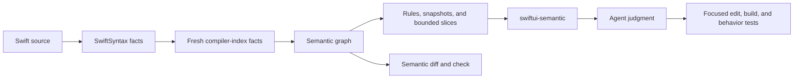

# SwiftUI Semantic Audit

**Give Codex or Claude a map of SwiftUI state before it edits code.**

`swiftui-semantic` is a SwiftUI architecture skill for coding agents. Its
deterministic engine, `swiftui-audit`, maps ownership, reads, writes, bindings,
effects, synchronization, and component boundaries before an agent changes
source. Compatible semantic snapshots then show what the refactor actually
changed.

The product is built for SwiftUI work that crosses file boundaries: explaining
an unfamiliar data flow, removing manual synchronization, narrowing component
inputs, or reviewing an agent-authored change. It does not rewrite source by
itself or ask a model to invent compiler facts.

> **Current release:** 0.5.0 · macOS 13 or later · MIT

[Website](https://swiftui-audit.dev/) · [Quick start](#quick-start) ·
[First audit](docs/getting-started/first-audit.md) ·
[Documentation](docs/README.md) ·
[Release 0.5.0](https://github.com/potapenko/swiftui-semantic-audit/releases/tag/0.5.0)

## Quick start

Give this prompt to a local Codex or Claude Code agent:

```text
Install SwiftUI Semantic Audit from this GitHub guide. Install Homebrew first if needed, then the CLI and all four agent skills:
https://github.com/potapenko/swiftui-semantic-audit/blob/master/docs/getting-started/installation.md
```

CLI only: `brew install potapenko/tap/swiftui-semantic-audit`. Homebrew owns
only `swiftui-audit`; the [installation guide](docs/getting-started/installation.md)
keeps the four agent skills separate and covers verification and removal.

Then ask for the SwiftUI outcome you already need:

```text
Use $swiftui-semantic to audit this project's SwiftUI ownership and data flow
without editing code.
```

The skill selects the audit, refactor, or review workflow internally. The
[prompt library](docs/getting-started/agent-prompts.md) contains longer recipes
for focused changes, existing-change review, project guardrails, and staged
migrations.

## What it makes inspectable

SwiftUI code can compile while hiding an imperative data-flow system underneath
`body`:

- local state mirrors a value that already has an owner;
- reciprocal `onChange` handlers keep mutable representations synchronized;
- custom `Binding` setters hide commands or unrelated effects;
- values, callbacks, models, or services cross unnecessary View boundaries;
- lifecycle, focus, geometry, or platform bridges drive product behavior.

Compiler diagnostics and style linters catch different problems. SwiftUI
Semantic Audit instead gives the agent stable identities, evidence-backed read
and write paths, compatible baselines, and bounded slices. The agent still has
to establish ownership, lifetime, transformation, transaction boundaries, and
product intent before changing code.

## One value, two owners

This editor stores one logical value in both an external `Binding` and local
`State`, then synchronizes the copies in both directions:

```swift
struct NameEditor: View {
    @Binding var name: String
    @State private var draft = ""

    var body: some View {
        TextField("Name", text: $draft)
            .onAppear { draft = name }
            .onChange(of: name) { _, value in draft = value }
            .onChange(of: draft) { _, value in name = value }
    }
}
```

The audit reports topology, not a wrapper preference:

```text
mirrored-state          high
manual-two-way-sync     high
logical sources         2
```

When both representations mean the same thing and share one lifetime, the
focused shape can be direct:

```swift
struct NameEditor: View {
    @Binding var name: String

    var body: some View {
        TextField("Name", text: $name)
    }
}
```

A real editor with **Apply** and **Discard** behavior is different. Its local
draft should remain local. The tool preserves that transaction boundary instead
of prescribing “Binding everywhere.”

[See the annotated walkthrough](https://swiftui-audit.dev/#xray) or
[browse the full pattern catalog](docs/concepts/pattern-catalog.md), including
model, callback, Binding, derivation, repository, and lifecycle examples.

## How the boundary works



The CLI owns syntax, symbols, topology, confidence, and source locations. The
agent may classify intent, explain risk, and choose a conditional remediation.
It must return `unknown` when the evidence cannot establish ownership, lifetime,
transformation, or transaction behavior.

You invoke one skill; it selects the smallest internal workflow:

| Requested result | Workflow |
| --- | --- |
| Explain ownership, synchronization, effects, or component boundaries | [Semantic audit](docs/workflows/audit.md) |
| Change one established state/data-flow cluster | [Data-flow refactor](docs/workflows/refactor.md) |
| Evaluate pre-existing SwiftUI changes | [Change review](docs/workflows/change-review.md) |

## Product surface

- **30 bounded rules** cover state ownership, derivation, synchronization,
  Bindings, component boundaries, effects, lifecycle, interaction, layout, and
  selected platform bridges.
- **Seven public commands** provide `scan`, `audit`, `snapshot`, `slice`,
  `diff`, `check`, and `doctor`.
- **Persistent evidence** records five-file snapshots, bounded finding or symbol
  slices, semantic diffs, and no-new-finding policy checks.
- **Explicit project roles** let config schema 2 identify screens, containers,
  reusable components, and component models without guessing from type names.

Read the [rule reference](docs/reference/rules.md),
[CLI reference](docs/reference/cli.md), and
[snapshot and diff guide](docs/reference/outputs-snapshots-and-diff.md) for the
complete surface.

## Boundaries

- Agent workflows require a fresh project-covering compiler Index Store and
  stop when indexed evidence is unavailable.
- Role-aware findings require exact project configuration; names such as
  `Repository`, `Service`, or `Model` never establish authority by themselves.
- The rules cover bounded SwiftUI topology, not every runtime, concurrency,
  security, or performance defect.
- A clean semantic diff does not prove behavior. Relevant builds, source review,
  and behavior tests remain required.
- The CLI does not call a model-provider API, rewrite source automatically, or
  install an IDE or Xcode extension.

## Documentation

- **Start:** [installation](docs/getting-started/installation.md),
  [first audit](docs/getting-started/first-audit.md), and
  [agent prompts](docs/getting-started/agent-prompts.md).
- **Understand:** [why semantic audit](docs/concepts/why-semantic-audit.md),
  [functional SwiftUI](docs/concepts/functional-swiftui.md),
  [pattern catalog](docs/concepts/pattern-catalog.md), and
  [deterministic facts versus agent judgment](docs/concepts/deterministic-facts-and-agent-judgment.md).
- **Apply:** [audit](docs/workflows/audit.md),
  [refactor](docs/workflows/refactor.md), and
  [change-review](docs/workflows/change-review.md) workflows.
- **Look up:** [commands](docs/reference/cli.md),
  [configuration](docs/reference/configuration.md),
  [rules](docs/reference/rules.md), and
  [outputs](docs/reference/outputs-snapshots-and-diff.md).
- **Contribute:** [development guide](docs/development/README.md).

The [documentation hub](docs/README.md) maps every public guide. Maintainers can
trace normative behavior through the [specification registry](docs/specs/README.md).

## Development

```bash
swift build --disable-automatic-resolution
swift test --disable-automatic-resolution
swift run --disable-automatic-resolution swiftui-audit doctor . --format json
```

The package requires a Swift 6.3-compatible toolchain. See the
[development guide](docs/development/README.md) for dependency, CI, fixture,
dogfood, and contribution details.

## License

Licensed under the repository [LICENSE](LICENSE).
