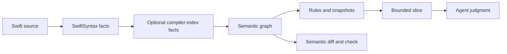

# SwiftUI Semantic Audit

**Make SwiftUI data flow inspectable before a coding agent edits it.**

`swiftui-audit` 0.4.0 turns Swift and SwiftUI source into a deterministic graph of state ownership, reads, writes, bindings, effects, derivations, and component boundaries. Its four agent skills use that graph to investigate architecture, guide a focused refactor, or review an existing change.

This is not a style linter, source-rewriting bot, or model-backed reviewer. SwiftSyntax and optional compiler-index enrichment establish facts. Rules select evidence-backed candidates. The coding agent judges intent without changing those facts.

> **Project status:** unreleased. There is no tagged binary, package-manager formula, or plugin release yet. Install from the current repository revision and record the commit you use.

[Install with an agent](#install-with-your-coding-agent) · [Run a first audit](docs/getting-started/first-audit.md) · [Understand the model](docs/concepts/why-semantic-audit.md) · [Browse all documentation](docs/README.md)

## The problem it addresses

SwiftUI makes view construction declarative, but an application can still become imperative underneath `body`:

- a local `@State` copy mirrors a value that already has an owner;
- two `onChange` handlers keep separate representations synchronized;
- values and setter callbacks travel through several views;
- a leaf view receives an entire model or service for one value or action;
- lifecycle, focus, selection, geometry, or a custom `Binding` setter hides a command;
- previews need the application composition root just to render a reusable component.

These patterns are hard to review from a text diff alone. The important question is rarely “Which property wrapper is used?” It is “Who owns this value, which representation is canonical, who may write it, for how long, and where do effects happen?”

SwiftUI Semantic Audit extracts that topology before an agent reads broad source. It gives the agent a bounded evidence set and makes architectural change measurable across snapshots.

## Install with your coding agent

Copy the prompt below into a **local** Codex or Claude Code session with terminal access. It installs the release CLI from source and links all four skills into the current host's personal skill directory. The repository remains the single source of truth, so updating it later does not create four drifting copies.

```text
Install SwiftUI Semantic Audit from the public repository
https://github.com/potapenko/swiftui-semantic-audit.git on this Mac.

Work carefully and report every path and version you select. Do not use sudo,
do not overwrite an existing file, directory, symlink, binary, or shell setting,
and do not delete or replace an earlier installation. If a destination already
exists, stop and report the exact conflict plus the safest next action.

1. Confirm that the operating system is macOS, Git is available, and a working
   Swift/Xcode toolchain is installed. Run `swift --version`, `xcode-select -p`,
   and `git --version`. Stop with a concrete prerequisite report if the package
   cannot be built.
2. Clone the repository's default branch into the stable user-owned directory
   `$HOME/.local/share/swiftui-semantic-audit`. The project is unreleased, so do
   not invent a version tag. Record the exact commit with `git rev-parse HEAD`
   and confirm that `origin` is the repository URL above.
3. From that clone, build the executable with the committed dependency lock:
   `swift build -c release --disable-automatic-resolution`. Do not update
   Package.resolved.
4. Install `.build/release/swiftui-audit` as `swiftui-audit` in a writable,
   user-owned bin directory already on PATH. Prefer `$HOME/.local/bin` when it
   is already on PATH; otherwise select another user-owned writable PATH entry.
   If no such directory exists, create `$HOME/.local/bin`, install the binary
   there, add it to PATH only for the current process, and report the exact
   shell configuration line the user may add later. Do not edit shell startup
   files without permission.
5. Detect the current agent host. For Codex, use `$HOME/.agents/skills`. For
   Claude Code, use `$HOME/.claude/skills`. For another compatible local host,
   use only its documented personal skill directory; do not guess. Create the
   parent directory if needed.
6. Link these four sibling directories from the clone's `skills/` directory
   into the selected personal skill directory, preserving each directory name:
   `swiftui-semantic`, `swiftui-semantic-audit`,
   `swiftui-dataflow-refactor`, and `swiftui-change-review`.
   Use symlinks so their relative references to sibling skills continue to work.
   Install all four, but treat `swiftui-semantic` as the only normal user-facing
   entry point.
7. Verify that every symlink resolves to a directory containing `SKILL.md`, that
   the four frontmatter names match their directory names, and that the router's
   links to all three specialist skills resolve.
8. Verify the CLI with `swiftui-audit --help` and
   `swiftui-audit doctor . --format json`. Keep JSON stdout separate from stderr
   and report warnings instead of hiding them.
9. Finish with a concise receipt containing: the exact repository commit, clone
   path, installed binary path, all four skill paths, host detected, verification
   results, and any PATH action still needed. State the invocation explicitly:
   Codex uses `$swiftui-semantic`; Claude Code uses `/swiftui-semantic`.
```

The prompt intentionally refuses to overwrite an existing installation. For a manual setup or an update, see [Installation](docs/getting-started/installation.md).

## Functional SwiftUI without dogma

“More functional” here does not mean forcing every screen into one wrapper pattern. It means making data movement easier to reason about:

| Goal | Practical meaning |
| --- | --- |
| One canonical owner where appropriate | Do not maintain a second mutable copy only to keep it synchronized. |
| Derived data stays derived | Compute a value from its inputs unless it has a real independent lifecycle. |
| Focused component inputs | Pass the value, binding, or action a component needs instead of an unrelated owner graph. |
| Explicit effects | Keep commands and external work visible rather than hiding them in setters or lifecycle correction loops. |
| Visible authority and lifetime | Make it clear who may write a value and how long the value should exist. |
| Protected transaction boundaries | Keep local drafts with real commit/cancel behavior and intentional transformations when they are semantically required. |

`Binding` is one possible representation, not the universal answer. Local `State`, `Bindable`, `Environment`, computed values, value/action inputs, and transactional drafts are all valid when their ownership and lifetime are correct.

Read [Functional SwiftUI](docs/concepts/functional-swiftui.md) for the full decision model.

## How it works



The boundary matters:

- the CLI owns deterministic syntax, symbol, read/write, topology, evidence, and source-location facts;
- the agent may classify intent, explain risk, and propose a conditional remediation;
- the agent must return `unknown` when ownership, lifetime, transformation, or transaction evidence is missing;
- neither the CLI nor the skills call a model-provider API.

See [Deterministic facts and agent judgment](docs/concepts/deterministic-facts-and-agent-judgment.md).

## Choose one workflow

Start with the `swiftui-semantic` router. It loads the smallest specialist workflow that matches the task.

| Requested outcome | Specialist workflow |
| --- | --- |
| Investigate ownership, synchronization, effects, or component boundaries | [`swiftui-semantic-audit`](skills/swiftui-semantic-audit/SKILL.md) |
| Change state ownership or data flow while preserving behavior | [`swiftui-dataflow-refactor`](skills/swiftui-dataflow-refactor/SKILL.md) |
| Review pre-existing SwiftUI changes | [`swiftui-change-review`](skills/swiftui-change-review/SKILL.md) |

Agent workflows require a fresh, project-covering compiler Index Store and accept only `resolution: "indexed"`. The installed skills pass the Index Store explicitly and stop when compiler-backed evidence is unavailable.

The workflow guides explain the full gates: [audit](docs/workflows/audit.md), [refactor](docs/workflows/refactor.md), and [change review](docs/workflows/change-review.md).

## What the 29 rules cover

The rule set targets evidence-backed topology in five related areas:

- mirrored state, reciprocal synchronization, stored derivation, and value/setter pairs;
- callback, observable-model, and broad component-input tunnels;
- custom Binding commands, factories, and multi-source getter/setter topology;
- owner/service boundaries, lifecycle effects, focus, selection, and preview composition;
- geometry-driven product behavior, gesture button emulation, representable updates, and direct global platform commands.

Role- and feature-aware rules use exact entries from `.swiftui-audit.json`. They remain silent when required classification is absent; names such as `Service` or `Controller` never create product-role facts by themselves.

See the [rule reference](docs/reference/rules.md) for every identifier, confidence level, and important exclusion.

## CLI at a glance

| Command | Result |
| --- | --- |
| `scan <path>` | Canonical semantic graph |
| `audit <path>` | Metrics, semantic values, and findings |
| `snapshot [path]` | Five-file persistent semantic sidecar |
| `slice [input]` | Minimal LLM-ready subgraph for one finding or symbol |
| `diff <base> <current>` | Semantic changes, new findings, and resolved findings |
| `check --baseline <base> [path]` | Policy result for new findings at or above a threshold |
| `doctor [path]` | Non-mutating toolchain, project, index, and Git diagnostics |

For exact syntax and failure behavior, use [`swiftui-audit <command> --help`](docs/reference/cli.md) and the [CLI reference](docs/reference/cli.md).

Live-source commands reuse content-addressed frontend and compiler-index facts automatically. Use `--cache-directory <path>` for an explicit persistent location or `--no-cache` to prove equivalence with a full rebuild. Cache state is never semantic evidence and never changes JSON output.

## First indexed pass

Build the target, record its fresh project-covering Index Store, and start with an indexed report:

```bash
swiftui-audit doctor . --format json
swiftui-audit audit Sources \
  --index-store /absolute/path/to/index/store \
  --format json > audit.json
```

Confirm `"resolution": "indexed"`, then continue through the [first-audit guide](docs/getting-started/first-audit.md).

## Outputs that survive a chat

A snapshot contains exactly five canonical files:

```text
manifest.json
nodes.jsonl
edges.jsonl
findings.jsonl
summary.json
```

Stable ordering, relative evidence paths, resolution checks, configuration digests, and referential-integrity validation make snapshots suitable for review and regression policy. `diff` describes semantic change; `check` fails only for new findings at or above the selected severity. A lower finding count alone is never proof that a refactor preserved behavior.

See [Outputs, snapshots, and semantic diff](docs/reference/outputs-snapshots-and-diff.md).

## Limits

- The frontend is not a full Swift type checker, SIL pipeline, or general interprocedural/control-flow analyzer.
- Indexed enrichment is macOS-only and requires a compatible compiler Index Store.
- Architecture rules are bounded to their documented SwiftUI topology and exact configuration.
- Live-source analysis incrementally reuses unchanged frontend and indexed facts; malformed or incompatible cache entries rebuild safely.
- Snapshot replacement supports one writer but has no concurrent-writer lock.
- Slice traversal is bounded and token estimation is byte-based.
- True renames may appear as removal plus addition.
- There is no automatic rewrite, embedded LLM API, IDE extension, GUI, Xcode extension, security analysis, or performance analysis.

## Documentation

The public documentation starts at [`docs/README.md`](docs/README.md):

- [Getting started](docs/getting-started/README.md)
- [Concepts](docs/concepts/README.md)
- [Workflows](docs/workflows/README.md)
- [Reference](docs/reference/README.md)
- [Development](docs/development/README.md)
- [Normative specification registry](docs/specs/README.md)

The specification package is the source of product truth. Public guides explain that contract; they do not replace it.

## Development

```bash
swift build --disable-automatic-resolution
swift test --disable-automatic-resolution
swift run --disable-automatic-resolution swiftui-audit doctor . --format json
```

The package requires macOS 13 or later and a Swift 6.3-compatible toolchain; SwiftSyntax is pinned to `603.0.2`. CI builds and tests locked dependencies, exercises indexed enrichment, audits positive and negative fixtures, proves snapshot determinism, runs diff/check/slice/doctor dogfood, and validates all four skills and documentation links.

See the [development guide](docs/development/README.md) and [active specification registry](docs/specs/README.md).

## License

Licensed under the repository [LICENSE](LICENSE).
