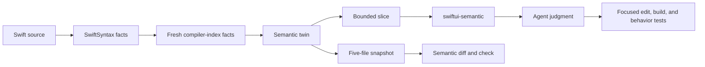

# SwiftUI Semantic Audit

**A deterministic semantic twin of a SwiftUI codebase, built for coding agents.**

SwiftUI Semantic Audit compiles supported Swift and SwiftUI source facts into a
compact, versioned model of ownership, state, Bindings, reads, writes,
derivations, dependencies, component boundaries, lifecycle, and effects. For
agent workflows, the CLI enriches that model with a fresh validated compiler
Index Store before a skill consumes it as semantic evidence.

The semantic twin is not an LLM summary or model-written pseudocode.
`swiftui-audit` owns deterministic extraction, evidence, snapshots, slices, and
semantic diff. The surrounding agent establishes intent and decides whether a
change is appropriate.

| Surface | Status | Capability |
| --- | --- | --- |
| Exact-state analysis | Available since `0.5.0` | Build an indexed semantic twin for one source state on demand |
| Project watcher | Included in `0.6.0` | Keep external live state ready for agents, gated by a matching fresh indexed receipt |

Public installation remains pinned to immutable `0.6.0`. Current `master`
prepares an unpublished `0.6.1` patch candidate that adds managed watcher
timeout configuration and selected-source analysis-config discovery; it is not
yet a Homebrew, tagged-skill, or website release.

macOS 13 or later · MIT

[Website](https://swiftui-audit.dev/) · [Install](#quick-start) ·
[Architecture](#how-the-semantic-twin-is-built) ·
[Documentation](docs/README.md) ·
[Release 0.6.0](https://github.com/potapenko/swiftui-semantic-audit/releases/tag/0.6.0)

## Quick start

For a new installation, give this prompt to a local Codex or Claude Code agent:

```text
Install SwiftUI Semantic Audit from this GitHub guide. Install Homebrew first if needed, then the CLI and all four agent skills:
https://github.com/potapenko/swiftui-semantic-audit/blob/0.6.0/docs/getting-started/installation.md
```

For an existing installation, use the stable website entry point so the agent
resolves the current release guide:

```text
Update SwiftUI Semantic Audit to the latest stable release using the guide linked from https://swiftui-audit.dev/#install. Update the Homebrew CLI and all four agent skills separately, then verify that they use the same release.
```

The immutable guide targets the `0.6.0` CLI through Homebrew, then
installs the four tagged skills as a separate phase. Homebrew owns only the
`swiftui-audit` executable.

CLI only:

```bash
brew install potapenko/tap/swiftui-semantic-audit
swiftui-audit --version
swiftui-audit doctor . --format json
```

`doctor` checks environment readiness. It accepts neither `--index-store` nor
`--config`, and it does not prove watcher freshness. For watcher-backed agent
work, freshness comes from the matching `project status --wait indexed` receipt.

Then ask for the SwiftUI outcome:

```text
Use $swiftui-semantic to audit this project's SwiftUI ownership and data flow
without editing code.
```

The router selects the audit, refactor, or change-review workflow. Those skills
consume the semantic twin; they do not invent or rewrite its emitted records.
Source edits produce a new twin.

## What the semantic twin is

The twin keeps supported program relationships that coding agents otherwise
have to reconstruct from scattered source:

- who owns each semantic value and who may write it;
- State, Binding, observation, injection, and initializer propagation;
- read, write, copy, derivation, call, trigger, and effect paths;
- configured screen, container, reusable-component, owner, and feature roles;
- source evidence, compiler identity, confidence, and analysis configuration;
- findings, bounded context slices, compatible snapshots, and semantic changes.

It deliberately drops much of the syntax that is not needed for that reasoning.
Source remains authoritative. The twin is not a runtime simulator, full type
checker, complete control-flow model, behavior proof, or substitute for source
review.

## How the semantic twin is built



Release `0.5.0` introduced the exact-state path: build the target source, pass its
project-covering Index Store to one invocation, and require valid JSON,
`resolution: "indexed"`, and the expected configuration digest. That path remains
the explicit fallback when no matching fresh watcher receipt is available.

The deterministic layer owns identities, topology, confidence, and source
locations. The agent may classify intent, explain risk, and propose a conditional
change. When ownership, lifetime, transformation, or transaction behavior is not
established, the correct answer is `unknown` plus the smallest missing evidence.

## One value, two owners

This editor stores one logical value in both an external `Binding` and local
`State`, then synchronizes the copies in both directions:

```swift
struct NameEditor: View {
    @Binding var name: String
    @State private var draft = ""

    var body: some View {
        TextField("Name", text: $draft)
            .onAppear { draft = name }
            .onChange(of: name) { _, value in draft = value }
            .onChange(of: draft) { _, value in name = value }
    }
}
```

The twin records two mutable representations, reciprocal copy paths, and the
`mirrored-state` plus `manual-two-way-sync` findings. If both representations
mean the same thing and share one lifetime, a direct Binding is the focused
shape. A real draft with explicit Apply and Discard remains a separate valid
transaction and receives no mechanical fix.

[See the annotated X-ray](https://swiftui-audit.dev/#xray) or the
[full pattern catalog](docs/concepts/pattern-catalog.md).

## Freshness, live state, and baselines

These artifacts have different jobs:

| Artifact | Role | Repository status |
| --- | --- | --- |
| Analysis cache | Reuses deterministic frontend and indexed facts; never semantic evidence by itself | External user cache |
| Live state | Watcher-owned status, preview, and indexed snapshot in `0.6.0` | External application state |
| Snapshot | Canonical five-file serialization of one semantic twin | Explicit destination |
| Baseline | Optional snapshot deliberately promoted for semantic diff/check | May be tracked in Git |

### 0.5.0 compatibility: exact-state workflow

Build the exact target state, pass its raw Index Store explicitly, verify indexed
resolution and configuration identity, and consume the result during that task.
This compatibility path does not use a watcher receipt.

### Project watcher in 0.6.0

Version `0.6.0` adds the project watcher to the CLI and tagged agent skills while
preserving the exact-state workflow from `0.5.0`.

The watcher keeps live state outside the repository. A coding agent may use a
live snapshot only when `project status --wait indexed` returns `fresh: true`,
indexed resolution, equal workspace and indexed-workspace digests, and the
expected configuration digest. Any later source change invalidates that receipt
for agent use immediately. The next status query recomputes the current digest
and reports the saved generation stale; build or enrichment failure keeps the
prior snapshot only as diagnostics.

```text
Use $swiftui-semantic to set up continuous semantic analysis for this project.
```

Setup previews its writes. The tracked project manifest and optional promoted
five-file baseline remain separate from external runtime state. Baseline
promotion is deliberate and never stages or commits files.

[Set up the project watcher](docs/getting-started/project-watcher.md).

## Commands and agent consumers

The CLI keeps seven one-shot analysis commands:

| Command | Purpose |
| --- | --- |
| `scan` | Emit the canonical semantic graph |
| `audit` | Evaluate 30 bounded rules over that graph |
| `snapshot` | Persist the exact five-file semantic twin |
| `slice` | Select one bounded finding or symbol envelope |
| `diff` | Compare compatible snapshots or supported Git operands |
| `check` | Fail only for new findings at or above a threshold |
| `doctor` | Inspect toolchain, project, Index Store, and Git readiness without mutation |

Version `0.6.0` adds the `project` namespace for setup, watch, status, service
lifecycle, and deliberate baseline promotion.

| Agent surface | How it consumes the twin |
| --- | --- |
| `swiftui-semantic` | Routes one request to the smallest valid workflow |
| `swiftui-semantic-audit` | Investigates ownership, synchronization, effects, and boundaries |
| `swiftui-dataflow-refactor` | Establishes a baseline, changes one cluster, and verifies the semantic delta |
| `swiftui-change-review` | Reviews compatible indexed snapshots before broad raw-diff reading |

## Boundaries

- Agent workflows require either a live snapshot paired with its matching fresh
  indexed status receipt or an explicit fresh project-covering Index Store. They
  stop when neither evidence path is available.
- Role-aware findings require exact project configuration; names such as
  `Repository`, `Service`, or `Model` do not establish authority.
- The 30 rules cover bounded SwiftUI topology, not every runtime, concurrency,
  security, persistence, navigation, or performance defect.
- A clean semantic diff does not prove behavior. Builds, source review, product
  invariants, and behavior tests remain required.
- Rename continuity is conservative and may appear as removal plus addition.
- The CLI does not call a model-provider API, rewrite Swift automatically, or
  install an IDE or Xcode extension.

## Documentation

- [Install release 0.6.0](docs/getting-started/installation.md)
- [Run the first indexed audit](docs/getting-started/first-audit.md)
- [Understand deterministic facts and agent judgment](docs/concepts/deterministic-facts-and-agent-judgment.md)
- [Operate snapshots and semantic diff](docs/reference/outputs-snapshots-and-diff.md)
- [Set up the project watcher](docs/getting-started/project-watcher.md)
- [Browse the complete documentation map](docs/README.md)

Maintainers can trace normative behavior through the
[specification registry](docs/specs/README.md).

## Development

```bash
swift build --disable-automatic-resolution
swift test --disable-automatic-resolution
swift run --disable-automatic-resolution swiftui-audit doctor . --format json
```

The package requires a Swift 6.3-compatible toolchain. See the
[development guide](docs/development/README.md) for dependency, CI, fixture,
dogfood, and contribution details.

## License

Licensed under the repository [LICENSE](LICENSE).
